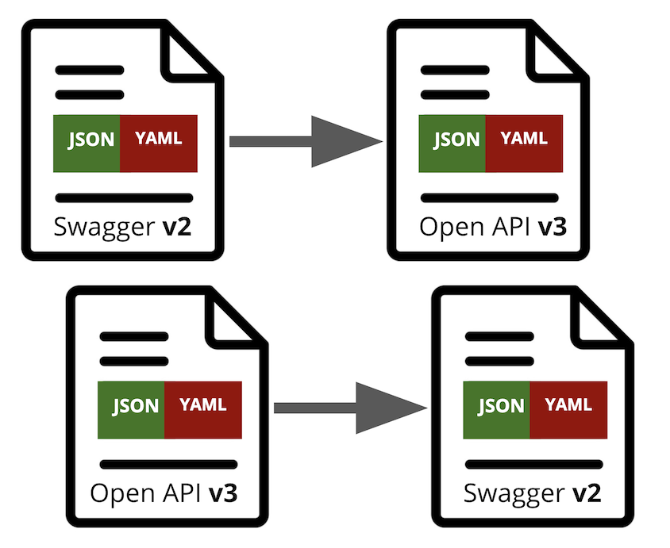
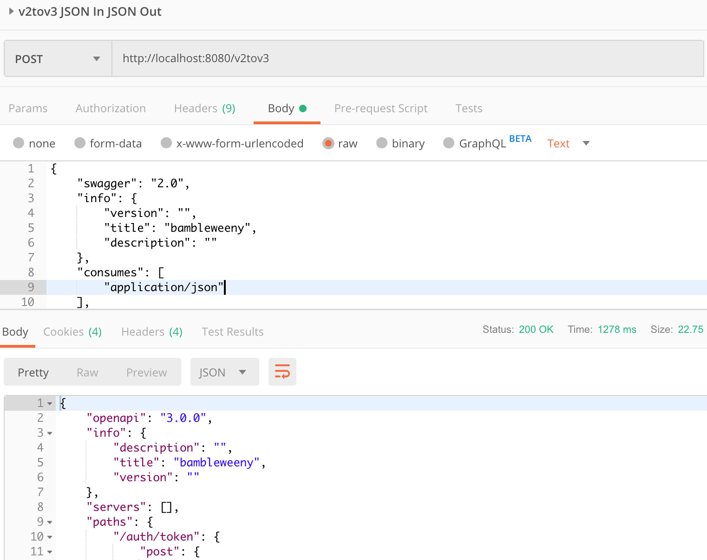

# samsa

Convert between OpenAPI v2 and v3 formats, it even converts YAML v2 to JSON v3 and all other combinations.

## Run

`docker run -d -p 8080:8080 u1ih/samsa:latest`

## Usage Examples

### Convert Swagger File to Open API v3, JSON Output

`curl -s -X POST -d@swagger2.json "http://localhost:8082/v2tov3"`
`curl -s -X POST -d@swagger2.yaml "http://localhost:8082/v2tov3"`

### Convert Swagger File to Open API v3, YAML Output

`curl -s -X POST -d@swagger2.json "http://localhost:8082/v2tov3?format=yaml"`
`curl -s -X POST -d@swagger2.json "http://localhost:8082/v2tov3?format=yaml"`

### Convert Open API v3 to File to Swagger (v2), JSON Output

`curl -s -X POST -d@oas3.json "http://localhost:8082/v3tov2"`
`curl -s -X POST -d@oas3.yaml "http://localhost:8082/v3tov2"`

### Convert Open API v3 to File to Swagger (v2), YAML Output

`curl -s -X POST -d@oas3.json "http://localhost:8082/v3tov2?format=yaml"`
`curl -s -X POST -d@oas3.yaml "http://localhost:8082/v3tov2?format=yaml"`

## Or do all that with Postman

[Swagger](samsa_swagger.json)
[Postman Collection](samsa.postman_collection.json)

